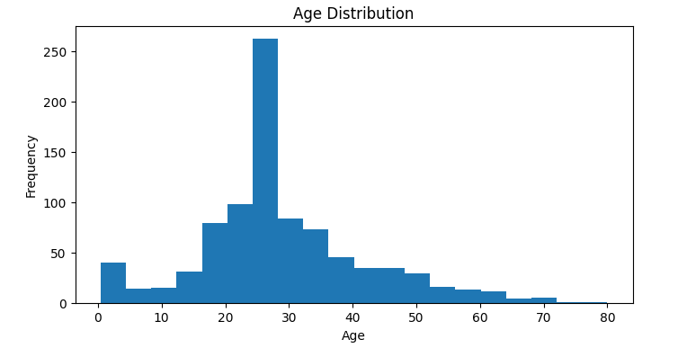
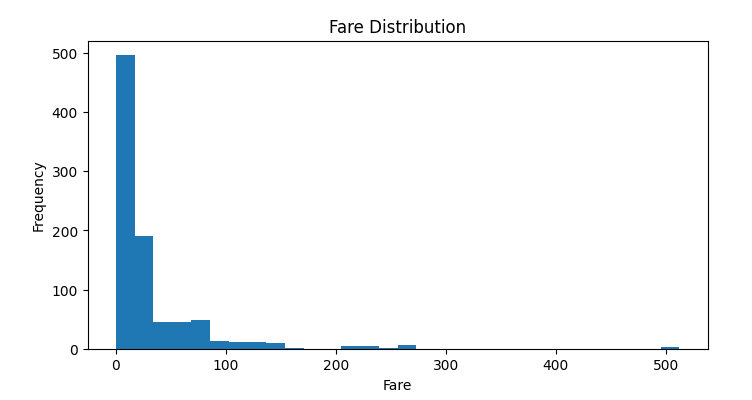
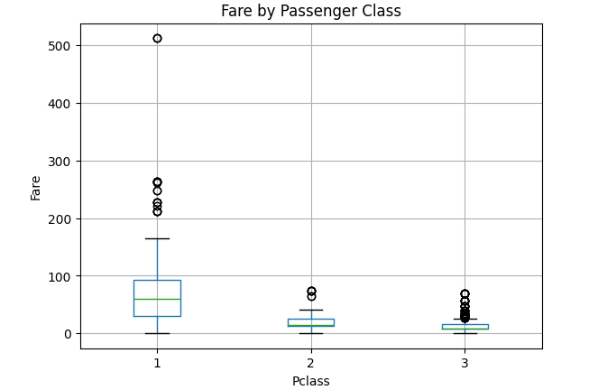
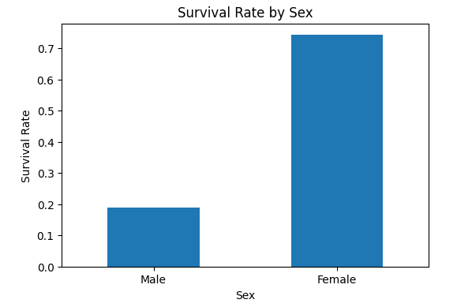
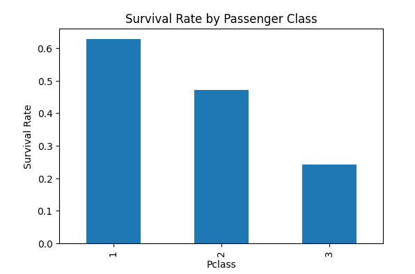
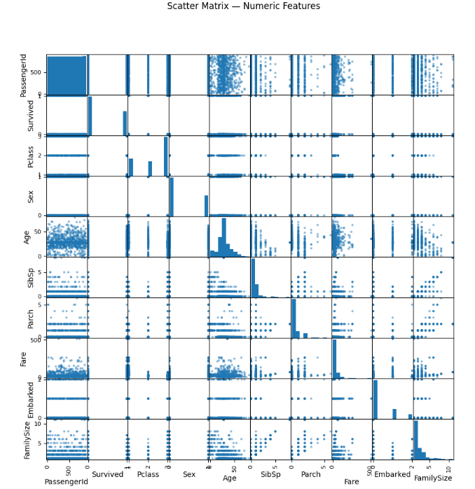
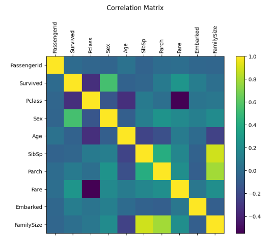

#  Titanic Dataset – Exploratory Data Analysis (EDA)

## Overview
This project is part of my **Data Analyst Internship Task 5**.
The goal is to perform **data cleaning**, **exploratory data analysis**, and **feature engineering**
on the Titanic dataset to prepare it for further modeling.

---

## Objectives
- Identify and handle missing data
- Explore data distributions and relationships
- Engineer new useful features
- Prepare a clean dataset for modeling

---

## Data Cleaning & Feature Engineering
- Filled missing **Age** (median) and **Embarked** (mode)
- Dropped **Cabin** column (too many missing values)
- Extracted **Title** from Name and **Deck** from Cabin
- Created **FamilySize = SibSp + Parch + 1**
- Encoded **Sex** and **Embarked** into numeric form

---

## Key Insights
- Females and 1st-class passengers had higher survival rates
- Fare distribution is right-skewed with a few high outliers
- Age mostly between 20–40 years
- Feature engineering improved dataset quality and interpretability

---

## Visualizations

### 1️) Age Distribution
+ Shows the spread of passenger ages (mostly between 20–40 years).

### 2️) Fare Distribution
+ Displays ticket fare amounts (right-skewed with a few high outliers).

### 3️) Fare by Passenger Class (Boxplot)
+ Compares fare values across different passenger classes.

### 4️) Survival Rate by Sex
+ Highlights that females had a much higher survival rate than males.

### 5️) Survival Rate by Passenger Class
+ Shows that passengers in higher classes had better chances of survival.

### 6) Scatter Matrix - Numeric Features

### 7) Correlation Matrix

---

## Tools Used
Python | Pandas | Matplotlib | Jupyter Notebook

---

